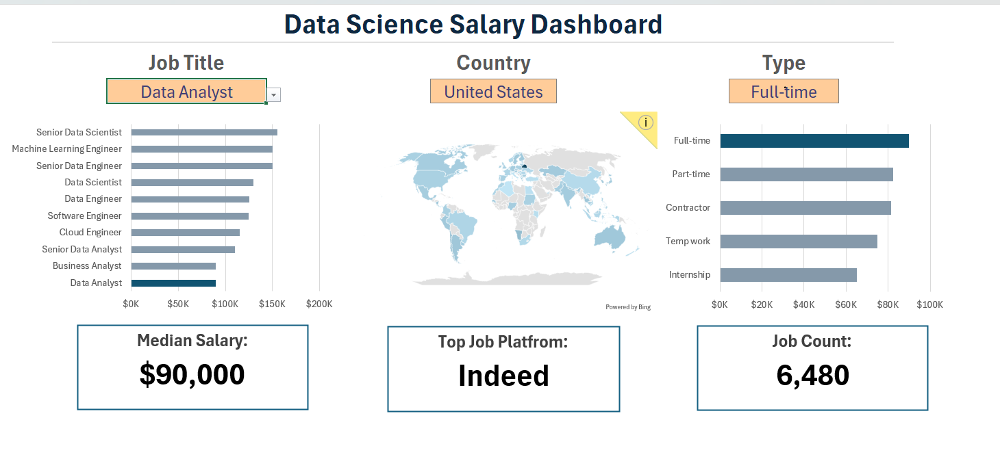

# Data Science Salary Dashboard — Excel

## 📊 Project Overview

An interactive Excel dashboard built to analyze data science salary trends across job roles, countries, and employment types.

The dashboard provides a visual overview of salary levels, job counts, and other key patterns to support data-driven insights.

## 🛠️ Tools & Skills

- Microsoft Excel
- Data Cleaning
- Data Analysis
- Pivot Tables
- Data Visualization
- Dashboard Creation

## 📈 Dashboard Preview

## 🔍 Key Insights

- Compared salary levels across different data science job roles.
- Analyzed salary patterns across countries.
- Compared job counts across different employment types.
- Identified the median salary for the selected criteria.
- Identified the most common job platform in the dataset.

## 📁 Project File

- `salary-analysis-dashboard.xlsx` — Complete Excel dashboard and analysis.

## 🎯 Objective

To transform salary data into meaningful insights through interactive analysis and visualization using Microsoft Excel.

